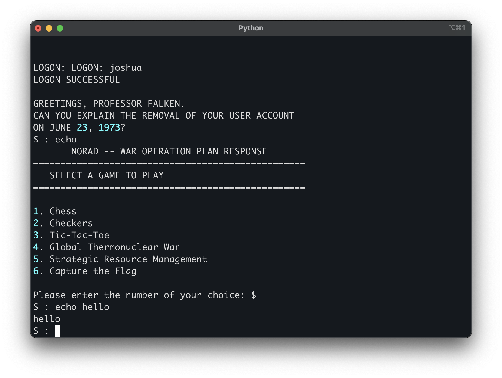

# WOPR CLI

WOPR CLI is a command-line interface tool for managing and interacting with the WOPR system.


## Features

- Play with `/private/agents/wopr` (from the brilliant team at sdsa.ai 🌟) directly in your terminal
- Mimic the user experience of the original online sdsa.ai website


## Installation

Find you way to an API key and server URL :) somewhere here ==> https://sdsa.ai

Add those 2 environment variables, you can put them into a `.env` file.
```
WOPR_KEY=key_here
WOPR_API_URL=url_here
```

```
virtualenv .venv
source .venv/bin/activate
python3 -m pip install -r requirements.txt
```

## Usage

```
python3 wopr.py
```

Have fun :)